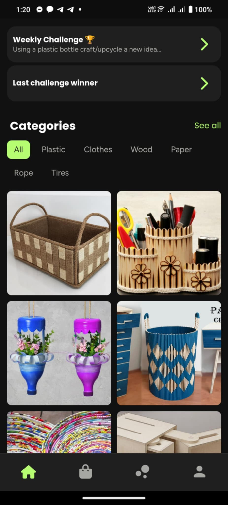
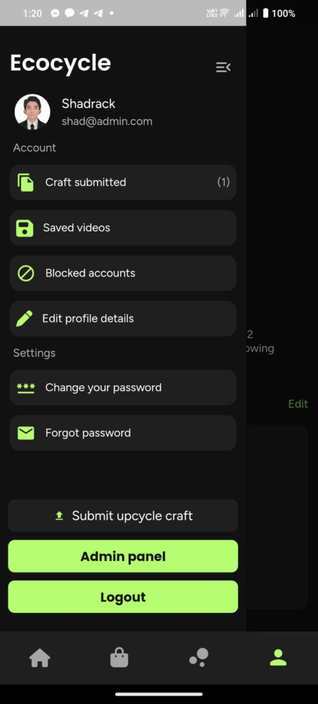
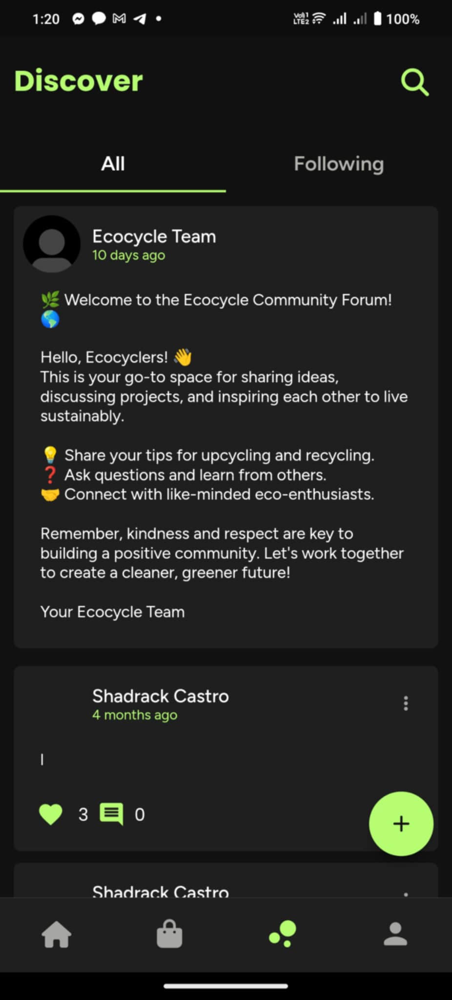

<body>

  

    <h1>Ecocycle 🌱 ♻️</h1>
    
<strong>Description:</strong>

    

      Developed to provide users with an organized platform for learning upcycling techniques through tutorial videos. 
      This idea was inspired by the growing need for accessible, structured learning resources on upcycling and sustainability.
    

  

  

    <h2>Features</h2>
    <ul>
      <li><strong>Upcycling Tutorial:</strong> Access a library of videos teaching various upcycling techniques.</li>
      <li><strong>Gamification Upcycle Challenge:</strong> Participate in fun, engaging challenges to put your skills to the test.</li>
      <li><strong>Submit a Tutorial:</strong> Share your own upcycling knowledge by submitting tutorial content.</li>
      <li><strong>Social Media Feature:</strong> Connect and share your upcycled creations with others in the community.</li>
    </ul>
  

  

    <h2>Screenshots</h2>
    
Here are some preview images of the app:

    
    
    
  

  

    <h2>Purpose</h2>
    

      This app promotes sustainability by encouraging the practice of upcycling through an easy-to-use and interactive learning environment.
    

  

</body>
</html>
